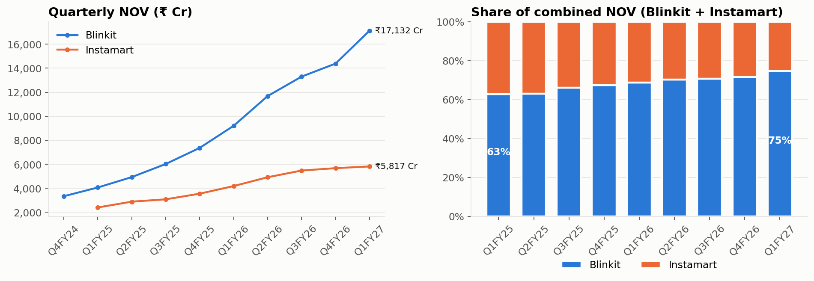

# Can Instamart Catch Blinkit?
**A unit-economics teardown of India's quick-commerce race: Blinkit vs Swiggy Instamart vs Zepto (Q4FY24 – Q1FY27)**



## The question
Instamart just reached contribution-margin break-even, but Blinkit is profitable at the EBITDA level and pulling away. Framed as a brief from Instamart's strategy team: **why does the gap exist, what would it take to close it, and which levers should leadership pull first?**

## Key findings
| # | Finding | Evidence |
|---|---|---|
| 1 | Blinkit's share of combined Blinkit + Instamart NOV rose **63% → 75%** in two years | Blinkit grew NOV 4.2×, Instamart 2.4× |
| 2 | The gap is **store throughput, not per-order margin** | ₹8.0L vs ₹5.5L NOV per store per day; fixed cost per store-day ₹38k vs ₹72k |
| 3 | The throughput gap is a **frequency gap** | 3.47 vs 2.83 orders/user/month; Blinkit's YoY growth ≈ entirely new users |
| 4 | My break-even model **independently reproduces management guidance** | ₹55–64k Cr annual NOV at 5.5% CM vs the ₹60k Cr guided (≈2.6× today) |
| 5 | Busy stores are necessary but not sufficient | Zepto's stores are the busiest (~2,140 orders/day) but a ₹387 basket keeps it at −₹59/order (Q4FY26) |

**Recommendation:** densify before you expand, and make frequency the North Star. +₹1 lakh NOV/store/day on today's network ≈ +₹4,300 Cr annual NOV (~₹235 Cr EBITDA) at near-zero extra fixed cost. The notebook includes the A/B test design and power analysis to validate a frequency lever.

## What's inside
```
app.py                            # Streamlit dashboard (7 tabs, filters, break-even simulator)
metrics.py                        # data loading + every derived metric, formulas commented
quick_commerce_case_study.ipynb   # full analysis, executed, with narrative + asserted headline numbers
data/
  qcom_quarterly_panel.csv        # Blinkit & Instamart quarterly KPIs, every row has a source URL + notes
  zepto_quarterly.csv             # Zepto: 12 quarters of KPIs from its June-2026 DRHP (SEBI)
  zepto_annual.csv                # Zepto FY25/FY26 annual figures
  management_guidance.csv         # guided break-even / ROCE assumptions with sources
  industry_context.csv            # dark-store counts incl. Flipkart Minutes, Amazon Now; Redseer market size
  events.csv                      # timeline: model shifts, fund-raises, regulation
  valuations.csv                  # market caps / Zepto valuation marks
charts/                           # exported PNGs from the notebook
scripts/build_data.py             # rebuilds the Blinkit/Instamart panel
.streamlit/config.toml            # theme
```

## Methods (skills demonstrated)
- **Data sourcing & cleaning:** hand-built a panel from 8 shareholder letters + IPO filing; reconciled definition changes (Blinkit's 2025 shift to an inventory-led model; GOV vs NOV; Zepto's NRV)
- **Metric validation:** my computed NOV/store/day tracks Blinkit's published figure within ±4% before I apply it to Instamart
- **Product analytics:** metric-tree growth decomposition (MTU × frequency × basket, log-additive)
- **Business analytics:** per-order P&L, fixed-cost absorption, operating-leverage analysis
- **Financial modelling:** break-even sensitivity heatmap; replication of Eternal's ROCE framework plus a tornado analysis
- **Experimentation:** A/B test design (unit, primary/guardrail metrics, CUPED), power analysis
- **Communication:** executive summary first, recommendations with sized impact, explicit limitations, tests on every headline number

## Run it
```bash
pip install -r requirements.txt
streamlit run app.py                          # dashboard
jupyter notebook quick_commerce_case_study.ipynb   # analysis
```

**Put the dashboard online (free):** push this folder to a public GitHub repo, go to [share.streamlit.io](https://share.streamlit.io), click *Create app*, pick the repo and `app.py`. You get a public `*.streamlit.app` link for your resume.

## Dashboard tabs
| Tab | What it answers |
|---|---|
| Market | Who's winning on orders and NOV; three-way order share |
| Store economics | Orders and sales per store per day; fixed cost per store-day; operating leverage |
| Per-order P&L | EBITDA per order over time; waterfall of one order's economics |
| Customers | Frequency vs basket; growth decomposition for any two quarters |
| Break-even simulator | Instamart EBITDA under your assumptions, incl. gig-worker social-security cost |
| Industry & timeline | New entrants' store counts, regulation and funding timeline, valuations |
| Data & method | Every table, downloadable, with sources |

## Limitations
Metric definitions differ across companies (Blinkit orders include cancellations; Zepto reports NRV, which includes ad income and fees, rather than NOV). Derived numbers are flagged in the CSVs. The operating-leverage link is correlational; store-level data would allow a vintage-cohort panel. This is an independent analysis of public data, not affiliated with any company.

## Sources
- Eternal shareholder letters: [Q1FY27](https://b.zmtcdn.com/investor-relations/Eternal_Limited_Shareholders_Letter_Q1FY27_Results.pdf), [Q4FY25](https://b.zmtcdn.com/investor-relations/d9c290cd23764a09789769c39682276a_1746094084.pdf), [Q3FY25](https://b.zmtcdn.com/investor-relations/681c57ac651e6e8f54c263ffbfc1e0b9_1737369246.pdf)
- Swiggy shareholder letters: [Q1FY27](https://www.swiggy.com/corporate/wp-content/uploads/2026/07/Q1-FY2027-Shareholder-letter.pdf), [Q4FY26](https://www.swiggy.com/corporate/wp-content/uploads/2026/05/Q4-FY2026-Shareholder-letter.pdf), [Q2FY26](https://www.swiggy.com/corporate/wp-content/uploads/2025/10/Q2-FY2026-Shareholder-letter.pdf), [Q1FY26](https://www.swiggy.com/corporate/wp-content/uploads/2025/07/Q1-FY2026-Shareholder-letter.pdf)
- Zepto: [abridged UDRHP on SEBI](https://www.sebi.gov.in/sebi_data/commondocs/jun-2026/Zepto%20Limited%20-%20abridged_p.pdf); coverage: [Entrackr](https://entrackr.com/fintrackr/zepto-doubles-revenue-in-fy26-losses-widen-to-rs-5905-cr-12016560), [Outlook Business](https://www.outlookbusiness.com/start-up/how-far-zepto-fell-short-of-its-breakeven-goals)
- Industry: [Business Standard on dark-store additions (Aug 2026)](https://www.business-standard.com/companies/news/beyond-expansion-quick-commerce-seeks-more-growth-from-existing-assets-126080200252_1.html), [Redseer figures via Digital in Asia](https://digitalinasia.com/india-quick-commerce-blinkit-zepto-instamart/), [TechCrunch on the 10-minute directive](https://techcrunch.com/2026/01/13/india-reportedly-tells-quick-commerce-firms-to-drop-10-minute-delivery-promise/), [Fisher Phillips on the labour codes](https://www.fisherphillips.com/en/insights/insights/indias-new-labor-codes-extend-social-security-coverage-to-gig-workers)
